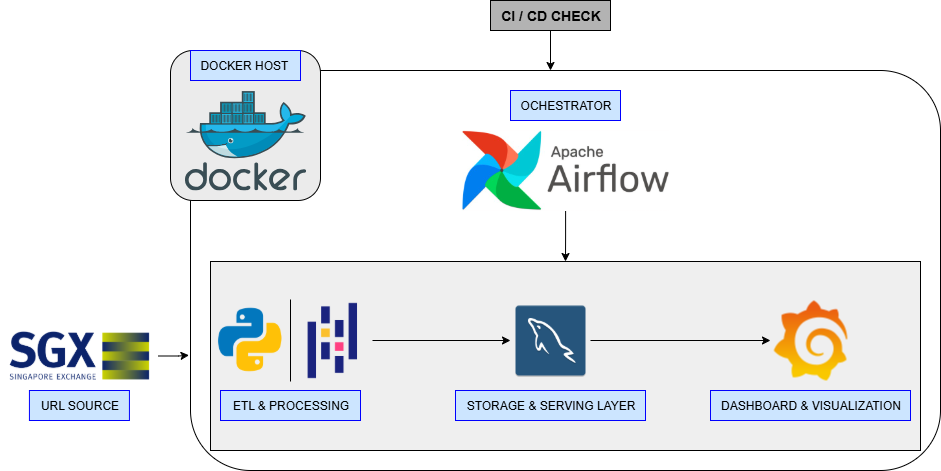
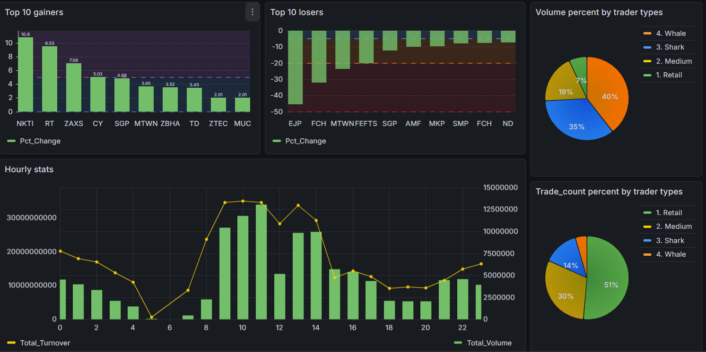

# 📈 SGX Stock Data Pipeline (End-to-End)


---

## 📁 Project Structure

```
airflow/
.
├── .github/                  # GitHub Actions CI/CD workflows
├── config/                   # Configuration files directory
├── dags/                     # Airflow DAGs orchestration
├── data/                     # Local data storage (Raw/Processed)
├── docs/                     # Project documentation
├── logs/                     # Airflow & Service logs
├── plugins/                  # Airflow custom plugins
├── scripts/                  # Python ETL scripts & helpers
├── sql_analysis/             # SQL scripts for data analysis
├── .env                      # Environment variables (Git ignored)
├── .gitignore                # Git ignore rules
├── config_example.ini        # Configuration template
├── config.ini                # Sensitive credentials (Git ignored)
├── docker-compose.yaml       # Container orchestration (Airflow, DBs)
├── grafana_dashboard.json    # Grafana dashboard export
└── README.md                 # Project overview
```
---

## 📖 Introduction & Purpose

Welcome to my **Data Engineering Learning Project**. 

The primary goal of this project is to bridge the gap between theory and practice. As an aspiring Data Engineer, I built this pipeline to master the core concepts of orchestration, containerization, and data analytics.

Simultaneously, this tool serves a practical purpose: it automates the tracking of the **Singapore Exchange (SGX)** derivatives market, allowing for the analysis of market trends, volume spikes, and capital flow.

*Note: This project represents my journey from a "newbie" to a practitioner. It focuses on clean code, stability on limited hardware (8GB RAM), and modern CI/CD practices.*

---

## ⚠️ Limitations & Learning Context

While this project functions effectively as a personal analytical tool, I am fully aware of the distinctions between this implementation and a production-grade enterprise data platform. The architectural choices were made to balance learning objectives with hardware constraints:

* **Technology Stack:** The use of `Pandas` and `MySQL` is optimized for a single-node environment with limited RAM. In a large-scale distributed environment, I recognize that this stack would evolve into **Apache Spark** for processing and Cloud Data Warehouses (e.g., **BigQuery**, **Snowflake**) or Data Lakes (e.g., **S3**, **HDFS**) for scalable storage.
* **Batch vs. Streaming:** Currently, the pipeline operates on a daily batch schedule. A more advanced iteration for real-time market data would necessitate event-streaming platforms like **Apache Kafka**.
* **Scope:** This project prioritizes the core logic of ETL and orchestration over complex distributed system management. It serves as a strategic stepping stone, allowing me to master the fundamentals before transitioning to cloud-native and distributed big data technologies in future projects.

---

## 🚀 Key Highlights & Performance Tuning

The most significant technical challenge in this project was **Memory Management**. Handling high-frequency trading data on a machine with limited resources (8GB RAM) initially led to frequent *Out Of Memory (OOM)* failures.

To solve this, I moved away from standard "load-all" approaches and implemented specific engineering optimizations:

* **Incremental Processing (Map-Reduce Style):** Instead of loading the entire dataset into memory, I implemented a streaming approach. The pipeline processes data in chunks, performs **partial aggregation** on the fly, and merges only the lightweight summary statistics. This keeps memory usage flat regardless of input file size.
* **Strict Data Typing (Downcasting):** Standard Pandas defaults to high-precision types (`float64`, `object`) which are memory-intensive. I enforced strict downcasting to `float32`, `uint32`, and `category` types, successfully reducing the memory footprint.
* **Aggressive Resource Management:** Python's garbage collector can be lazy. I implemented manual memory management by explicitly deleting temporary variables (`del chunk`) and forcing garbage collection (`gc.collect()`) immediately after each processing cycle to prevent memory leaks.
* **Algorithmic Optimization:** I identified that parsing dates using `pd.to_datetime` was a major bottleneck. I replaced this with vectorised mathematical operations (integer division/modulo) to extract time components directly from raw logs.

---

## 📊 Business Logic & Analytics

The system focuses on **Market Microstructure** and **Order Flow Analysis**:

* **Trader Classification:** classifying trades into *Retail, Medium, Shark,* and *Whale* based on lot size to detect institutional movements.
* **Session Leaderboard:** Identifying the most active contracts within a trading session.
* **Price Action:** Monitoring Open/High/Low/Close (OHLC) and calculating Turnover per hour.

---

## 🏗️ Architecture and Schema 
This is the data flow, which is fullied containerized by Docker:

<p align="center">
  
</p>

👉 **Full Schema Documentation:** [View Data Dictionary](docs/DATA_DICTIONARY.md)

### Data Flow:
1.  **Ingestion:** Airflow triggers Python scripts to download raw daily ZIP files (Tick Data) from SGX.
2.  **ETL:** Python (Pandas) aggregates data in-memory to create lightweight fact tables (Hourly Stats, Trade Distribution) to reduce load on the database.
3.  **ELT:** Cleaned and aggregated data is loaded directly into **MySQL**, creating refined tables ready for reporting and in-depth analysis.
4.  **Visualization:** **Grafana** connects to MySQL to visualize trends (Candlestick charts, Volume analysis).
5.  **CI/CD:** GitHub Actions automatically lints the Python code (Flake8) on every push to ensure code quality.

---

## 🛠️ Tech Stack

* **Orchestration:** Apache Airflow (LocalExecutor - Optimized for low-resource environments).
* **Containerization:** Docker & Docker Compose.
* **Database (Warehouse):** MySQL 8.0.
* **Transformation:** Python 3.11 (Pandas, SQLAlchemy).
* **Visualization:** Grafana.
* **CI/CD:** GitHub Actions (Automated Linting).

---

## 📊 Key Features & Analytics

The pipeline produces the following analytical outputs:

* **Hourly Market Stats:** Tracks Total Volume, Turnover (Total Money Flow), and OHLC (Open-High-Low-Close) prices per hour.
* **Trade Distribution (Whale vs. Retail):** Classifies trades based on volume to identify "Shark" (Institutional) vs. "Retail" activity.
* **Daily Summary:** End-of-day aggregation for long-term trend analysis.

---

## 📸 Dashboard Preview

Below are snapshots of the Grafana Dashboard:

<p align="center">
  
</p>

---

## 📝 Lessons Learned
Building this project taught me several valuable lessons:

1. Resource Management: How to optimize Docker and Airflow (switching from Celery to LocalExecutor) to run smoothly on an 8GB RAM machine.

2. Hybrid Data Processing: Combining ETL and a little of ELT to leverage the strengths of both Python (Loop processing) and MySQL (Storage).

3. DevOps Basics: The importance of Git, .gitignore, and setting up a basic CI pipeline to catch errors early.

---

## 🔜 Future Improvements
1. Using and supplement more standard and better techstacks in real data platforms such as: Data Lake, Apache Spark(processing), BigQuery(Data Warehouse),.....

2. Implement dbt (data build tool) for more complex SQL transformations.

3. Migrate the database to a cloud solution (AWS RDS or Google Cloud SQL).

4. Add alerting via Slack/Telegram when specific market conditions are met.
......

---

----Created with ❤️ and ☕ by Le Cong Minh---- 
